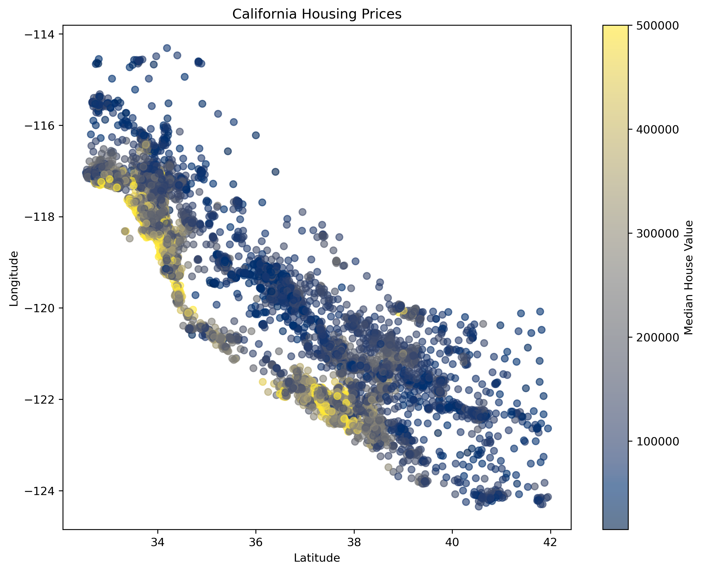
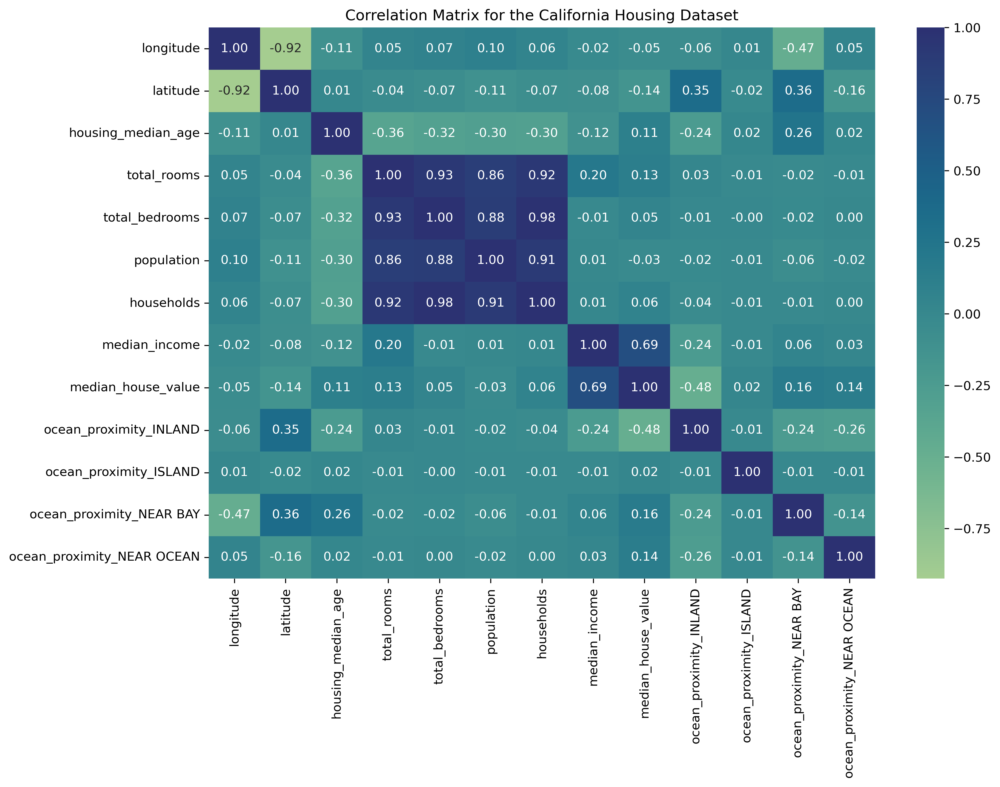
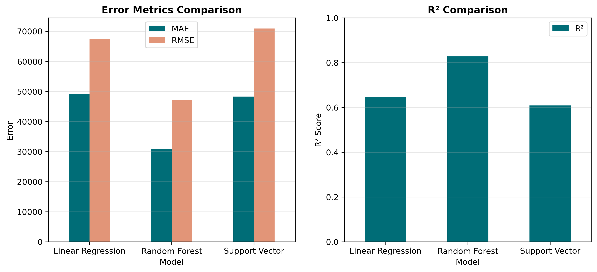
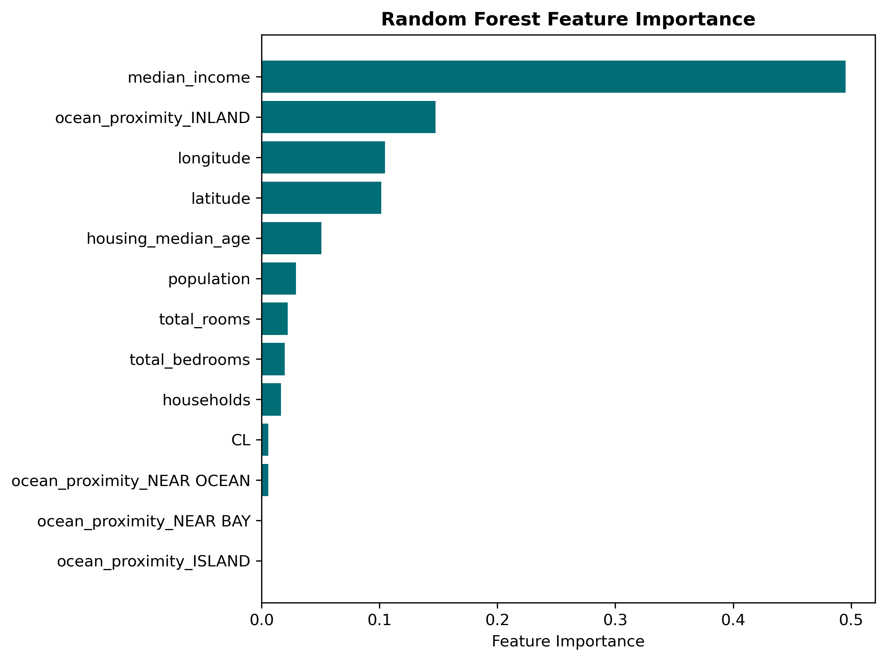
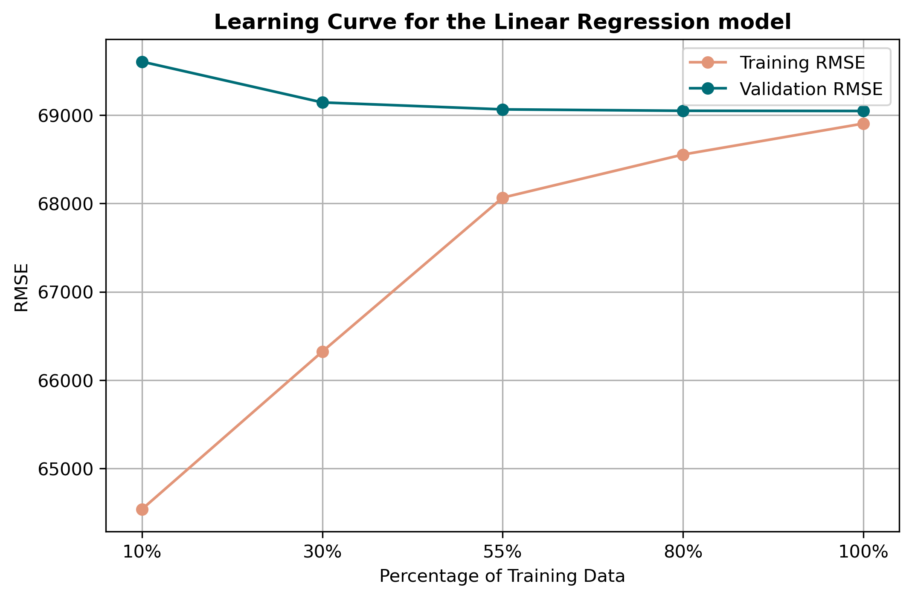
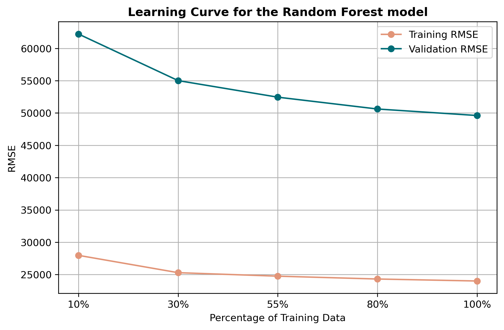
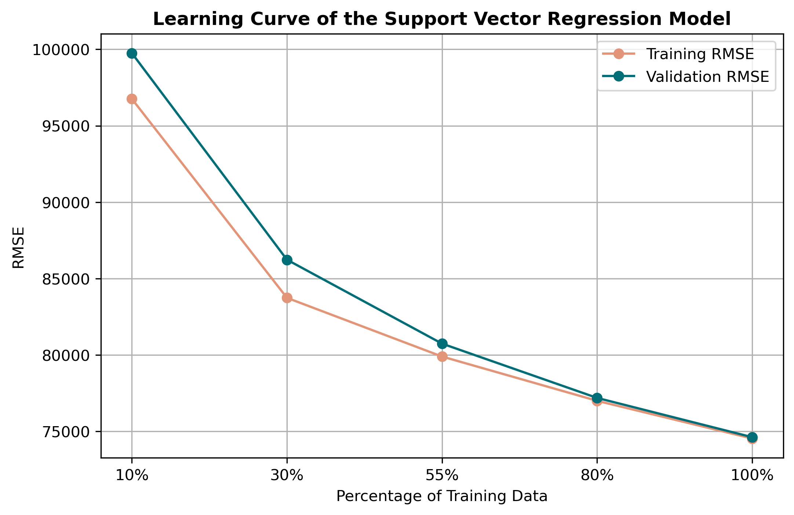

<h1 align="center">
California Housing Price Prediction
</h1>

<p align="center">
Comparing classical machine learning models and neural networks for real-world house price prediction.
</p>

<p align="center">


</p>

---

# Overview

Estimating house prices is a challenging regression problem because housing markets are influenced by numerous socioeconomic and geographic factors.

This project compares four different predictive models on the California Housing dataset to investigate how model complexity affects predictive performance.

Rather than assuming that more complex models always perform better, the goal was to evaluate each approach objectively using the same preprocessing pipeline and evaluation metrics.

---

# Results

| Model | R² | RMSE ($) |
|:--------------------------|------:|---------:|
| 🌲 Random Forest | **0.83** | **47,074** |
| 📈 Linear Regression | 0.65 | 67,386 |
| 🧠 Multilayer Perceptron | 0.64 | 68,301 |
| ⚙️ Support Vector Regression | 0.61 | 70,930 |

> **Key finding:**  
> The Random Forest model achieved the highest predictive performance, while the neural network produced almost identical results to Linear Regression despite its higher computational complexity.

---

# Machine Learning Pipeline

The workflow consisted of:

- Data preprocessing
- Exploratory Data Analysis
- Feature Engineering
- K-Means Clustering
- Principal Component Analysis
- Hyperparameter Optimization
- Model Training
- Performance Evaluation

---

# Exploratory Data Analysis

### Geographic Distribution of Housing Prices

<p align="center">

</p>

Housing prices vary substantially across California, with coastal regions exhibiting considerably higher property values than inland areas.

---

### Correlation Matrix

<p align="center">

</p>

Median income demonstrated the strongest positive correlation with house value, while several population-related variables exhibited multicollinearity.

---

# Model Performance

<p align="center">

</p>

Random Forest consistently achieved the lowest prediction error across every evaluation metric.

---

# Feature Importance

<p align="center">

</p>

The model identified **median income** as the strongest predictor, followed by geographical variables such as longitude, latitude, and ocean proximity.

---

# Learning Curves

<p align="center">

</p>
<p align="center">

</p>
<p align="center">

</p>


Learning curves were used to evaluate convergence, bias, variance, and generalization for each model.

---

# Technologies

- Python
- Pandas
- NumPy
- Scikit-learn
- TensorFlow / Keras
- Matplotlib
- Seaborn
- Jupyter Notebook

---

# Repository Structure

```text
.
├── images/
├── notebooks/
├── README.md
├── requirements.txt
├── LICENSE
└── .gitignore
```

---

# Dataset

The California Housing dataset is publicly available through **Scikit-learn**.

It is **not included** in this repository.

```python
from sklearn.datasets import fetch_california_housing
```

---

# Future Improvements

- XGBoost and LightGBM
- Bayesian Hyperparameter Optimization
- Explainable AI (SHAP)
- Additional socioeconomic features
- Hybrid ensemble models

---

# Author

**Ahmed Al Dulaim**

Biomedical Engineer  
MSc Data Science — University of Exeter
